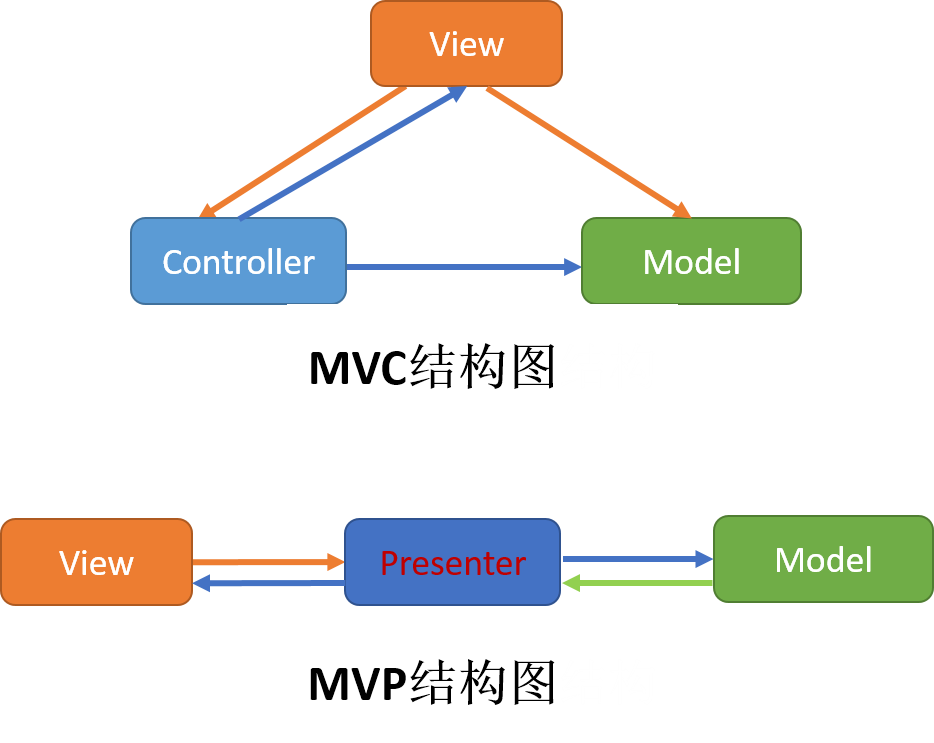

## android架构

### 为什么项目需要分层架构

一般来说app开发最耗时的编码为UI界面的绘制和逻辑代码的书写。

1. 如果将UI代码和逻辑代码的书写放在一起，后期更改UI代码或逻辑代码，自然会影响其它的代码，增加bug几率。
2. 如果将UI代码和逻辑代码的书写放在一起，后期无法分别给UI代码和逻辑代码添加自动化测试。

采用分层架构的思想，可以将app开发划分为UI层和逻辑层等。总体的目的就是解耦和方便测试，方便扩展功能。

常见的分层架构图（mvc和mvp）：

### MVC

mvc模式之前是在web端提出的。对于android上的mvc来说，view层指定是layout文件和activity类；model指定是创建出来的逻辑代码；controler层指定是activity，由于android上的mvc分层结构对UI层和逻辑层划分的不是很明确，造成了有点activity中的代码非常多。而且在app开发过程中，一般来说是UI层变动的比较频繁，而逻辑层变动相对会少一点。此时这种分层架构方式就不符合实际开发需求了。

### mvp

mvp分层架构师在mvc上衍生而来，UI层和逻辑层完全被Presenter层隔断，层与层直接通过接口交互，非常完美的解决了mvc模式出现的问题。

### 实际使用

实际开发中一个app的架构不光有分层架构的，你还需要抽出比如通用的工具类代码，通用的控件代码，通用的网络代码，数据库操作代码。总之而言，我们对一个app做出架构的目的是，为了我们更快更好的开发。

> [我的mvp开发实例](https://github.com/minyangcheng/VipShare)