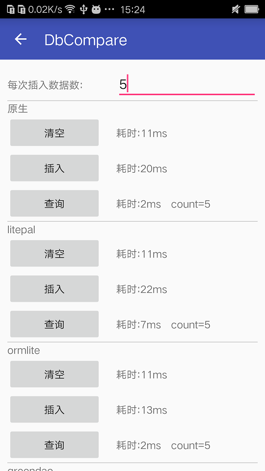
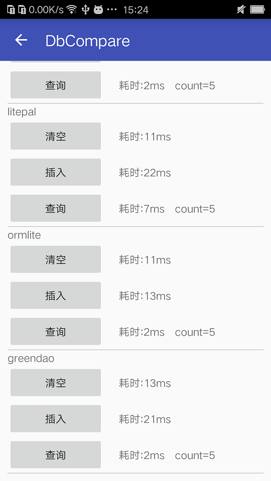
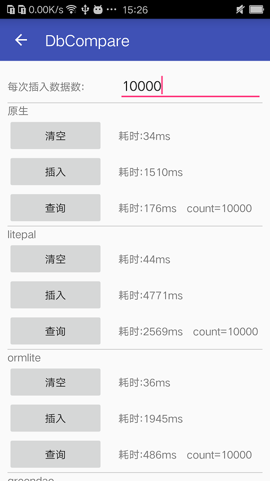
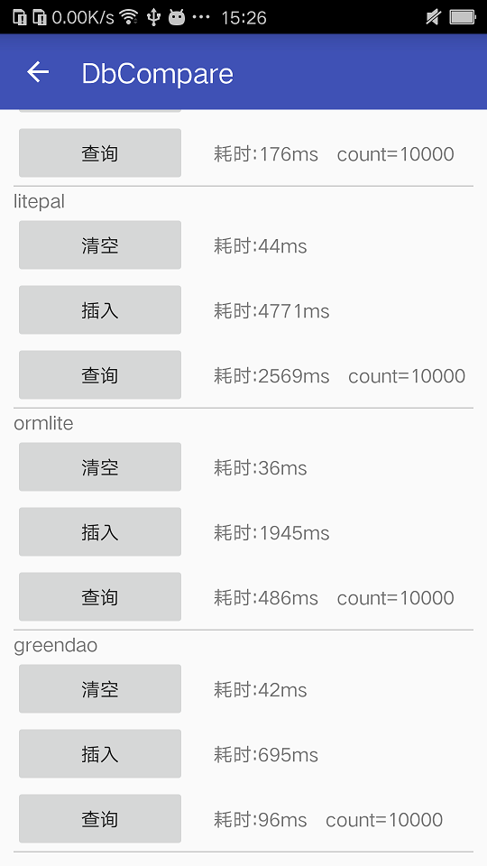

# DbCompare

项目中难免会对数据库进行操作，现在开源的数据操作库有许多，如Litepal、GreenDao等等，我也用过这其中的几个。一直也没有专门的对它们去做下对比。趁着工作闲暇时间，我专门选择了Litepal、GreenDao、Ormlite库进行对比，选择出一款api比较友好的、性能佳的数据库操作库。

>源码地址 : <https://github.com/minyangcheng/DbCompare>

<!-- more -->

## 对比数据库操作读写时间

我这里分别用原生的Sql、Litepal、Ormlite、GreenDao，向数据库插入5条和10000条数据，并且记录各个操作执行的时间，作对比。直接上图片：

### 插入5条数据的读写时间




### 插入10000条数据的读写时间




通过对比观察，greendao在各个方面的速度都比其它的快，选用greendao作为数据库操作库，比较好。

## GreenDao用法

GreenDao老版本的用法很奇葩，是需要一个java工程生成GreenDao操作需要的类。不过最新版本已经改进了这一点，采用注解的方式，非常方便。

具体的用法请直接查看官网：<http://greenrobot.org/greendao>

* 需要说明的是：更新插入数据最好用greendao自带的api进行操作，因为greendao自带有对象缓存机制，如果用下面这种方式更新数据库表后，在操作完成后，查询处理出来的数据还是保持原样。下面这种用法就需要在更新数据成功后调用getDaoSession().clear()一下。[官方说明](http://greenrobot.org/greendao/documentation/sessions/)

```
mStudentDao.getDatabase().execSQL("UPDATE STUDENT SET NAME='zhang' WHERE ID=1");
getDaoSession().clear()
```

## 数据库升级方案

GreenDao比较蛋疼的是没有集成数据库升级功能，这个需要自己在onUpgrade方法中实现。
* 大致实现升级的步骤：
    1. 复制旧Student表为Student_Temp
    2. 删除旧Student表
    3. 生成新的Student表
    4. 计算Student_Temp和新Student表中的公共的列字段提取出来
    5. 按照公共字段，将Student_Temp表中的值复制到Student表中

```java
public class GreendaoDBOpenHelper extends DaoMaster.OpenHelper {

    private static final String TAG="GreendaoDBOpenHelper";

    public GreendaoDBOpenHelper(Context context,SQLiteDatabase.CursorFactory factory) {
        super(context, "greendao_db.db", factory);
    }

    @Override
    public void onUpgrade(SQLiteDatabase db, int oldVersion, int newVersion) {
        L.d(TAG,"数据库升级 oldVersion=%s,newVersion=%s",oldVersion,newVersion);
        StandardDatabase database=new StandardDatabase(db);
        MigrationHelper.migrate(database, StudentDao.class);
    }

}
```

```java
public final class MigrationHelper {

    public static void migrate(Database db, Class<? extends AbstractDao<?, ?>>... daoClasses) {
        generateTempTables(db, daoClasses);
        dropAllTables(db, true, daoClasses);
        createAllTables(db, false, daoClasses);
        restoreData(db, daoClasses);
    }

    private static void generateTempTables(Database db, Class<? extends AbstractDao<?, ?>>... daoClasses) {
        for (int i = 0; i < daoClasses.length; i++) {
            DaoConfig daoConfig = new DaoConfig(db, daoClasses[i]);
            String tableName = daoConfig.tablename;
            String tempTableName = daoConfig.tablename.concat("_TEMP");
            StringBuilder insertTableStringBuilder = new StringBuilder();
            insertTableStringBuilder.append("CREATE TEMPORARY TABLE ").append(tempTableName);
            insertTableStringBuilder.append(" AS SELECT * FROM ").append(tableName).append(";");
            db.execSQL(insertTableStringBuilder.toString());
        }
    }

    private static void dropAllTables(Database db, boolean ifExists, @NonNull Class<? extends AbstractDao<?, ?>>... daoClasses) {
        reflectMethod(db, "dropTable", ifExists, daoClasses);
    }

    private static void createAllTables(Database db, boolean ifNotExists, @NonNull Class<? extends AbstractDao<?, ?>>... daoClasses) {
        reflectMethod(db, "createTable", ifNotExists, daoClasses);
    }

    /**
     * dao class already define the sql exec method, so just invoke it
     */
    private static void reflectMethod(Database db, String methodName, boolean isExists, @NonNull Class<? extends AbstractDao<?, ?>>... daoClasses) {
        if (daoClasses.length < 1) {
            return;
        }
        try {
            for (Class cls : daoClasses) {
                Method method = cls.getDeclaredMethod(methodName, Database.class, boolean.class);
                method.invoke(null, db, isExists);
            }
        } catch (NoSuchMethodException e) {
            e.printStackTrace();
        } catch (InvocationTargetException e) {
            e.printStackTrace();
        } catch (IllegalAccessException e) {
            e.printStackTrace();
        }
    }

    private static void restoreData(Database db, Class<? extends AbstractDao<?, ?>>... daoClasses) {
        for (int i = 0; i < daoClasses.length; i++) {
            DaoConfig daoConfig = new DaoConfig(db, daoClasses[i]);
            String tableName = daoConfig.tablename;
            String tempTableName = daoConfig.tablename.concat("_TEMP");
            // get all columns from tempTable, take careful to use the columns list
            List<String> columns = getColumns(db, tempTableName);
            ArrayList<String> properties = new ArrayList<>(columns.size());
            for (int j = 0; j < daoConfig.properties.length; j++) {
                String columnName = daoConfig.properties[j].columnName;
                if (columns.contains(columnName)) {
                    properties.add(columnName);
                }
            }
            if (properties.size() > 0) {
                final String columnSQL = TextUtils.join(",", properties);

                StringBuilder insertTableStringBuilder = new StringBuilder();
                insertTableStringBuilder.append("INSERT INTO ").append(tableName).append(" (");
                insertTableStringBuilder.append(columnSQL);
                insertTableStringBuilder.append(") SELECT ");
                insertTableStringBuilder.append(columnSQL);
                insertTableStringBuilder.append(" FROM ").append(tempTableName).append(";");
                db.execSQL(insertTableStringBuilder.toString());
            }
            StringBuilder dropTableStringBuilder = new StringBuilder();
            dropTableStringBuilder.append("DROP TABLE ").append(tempTableName);
            db.execSQL(dropTableStringBuilder.toString());
        }
    }

    private static List<String> getColumns(Database db, String tableName) {
        List<String> columns = null;
        Cursor cursor = null;
        try {
            cursor = db.rawQuery("SELECT * FROM " + tableName + " limit 0", null);
            if (null != cursor && cursor.getColumnCount() > 0) {
                columns = Arrays.asList(cursor.getColumnNames());
            }
        } catch (Exception e) {
            e.printStackTrace();
        } finally {
            if (cursor != null)
                cursor.close();
            if (null == columns)
                columns = new ArrayList<>();
        }
        return columns;
    }

}
```

## 总结

数据库操作选用GreenDao，并用GreenDao内部的api基本满足大部分需求，如果碰到了特殊情况，也是可以调用GreenDao去执行SQL的。