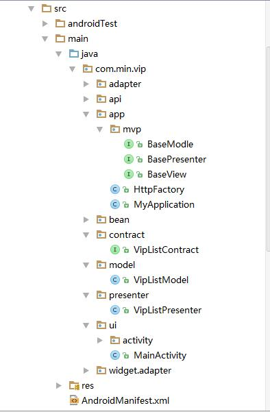

### VipShare

> 共享各个视频网站上的用户名和密码

#### 架构
* 采用mvp架构

* 插件化开发

#### 开源库

1. rxjava
2. retrofit+okhttp
3. gson
4. virtualapk

#### 封装自己的框架库framework
1. 通用工具类
2. 网络层处理
3. 封装下拉刷新上拉加载通用解决方案

#### gradle配置
gradle配置方案