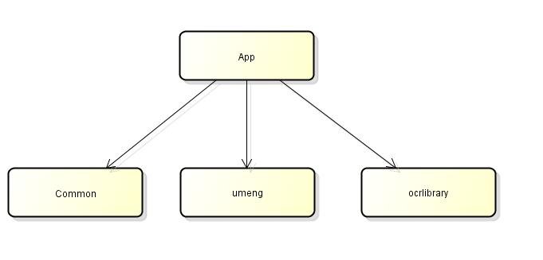
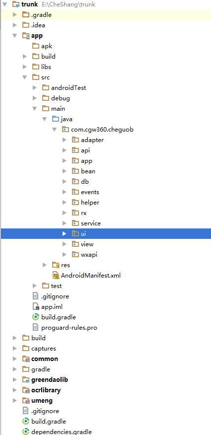
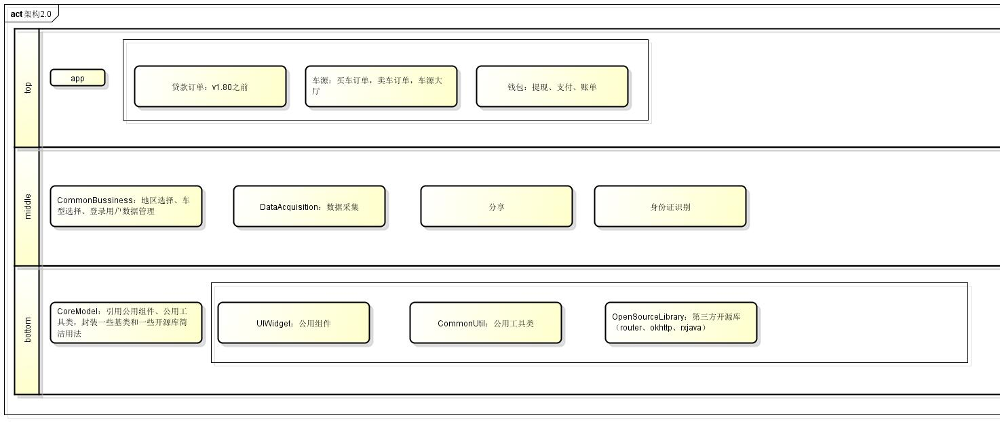
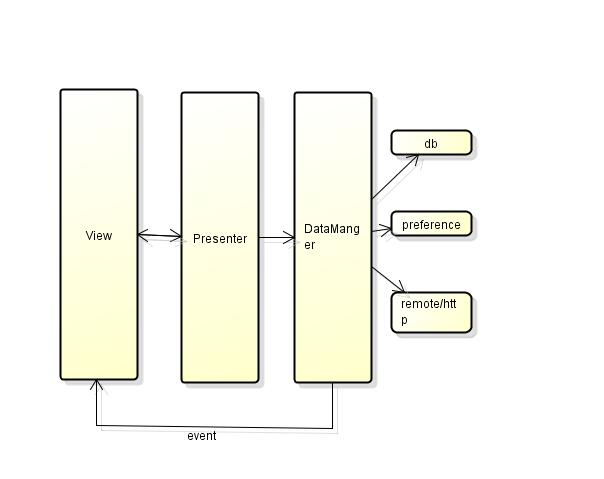

# 车国商户版

## 架构1.0.0

### 简单说明（如图）

1. 项目代码整体上分成两层，公共代码放在common、umeng、ocrlibrary，业务类代码放在app内。
2. app module内部采用的是mvc模式，ui部分按照业务进行分包

### 痛点

1. 团队间分模块并行开发越来越复杂，测试往往也不能够进行特定模块单独测试
2. app moudle随着业务的增长越来越大，项目文件不易分类查找
3. 编译时间长
4. 代码复用性差，假设C端需要做一个和B端的一样业务模块，就需要需要一步一步粘贴拷贝代码

## 架构2.0.0

### 简单说明（如图）

1. 项目代码整体上分成三层，主要采用组件化思想，每一层中的module是一个单一功能的组件，以后需要啥功能只需要引用该功能的library，bottom和middle层上的module可以在不同的项目中复用
2. top层的module内部采用的是mvp模式,该层的moudle都可以单独开发测试，并打包成apk
3. bottom层的CoreModel主要用于统一封装该层其他组件，提供一些开源库更加简洁用法，其它两层可直接依赖CoreModel

### top module

1. top层的module主要采用mvp模式，业务代码转移到presenter，数据来源统一到DataManger中
2. 简单的页面逻辑，可以省略掉presenter层，直接在view层使用DataManger

### top module communication

top层module之间的交互，采用 [路由router](https://github.com/drakeet/Floo)

## hybird开发模式

项目中很多业务可以直接用H5方式直接书写。

1. 通过预先定义的bridge协议方法通信
2. 原生和h5之间页面跳转通过 [路由router](https://github.com/drakeet/Floo)，h5之间页面跳转通过[vue-router](https://router.vuejs.org/zh-cn/)
3. 页面上的点击位，全部可以在服务器直接配成路由链接的方式，当用户点击是直接用路由做跳转。如果当线上的包所跳转的原生界面出现了紧急bug，我们就可以直接把路由路径切换成H5页面，这样就可以不用发包升级啦
4. 考虑到vue页面会再第一次加载的时候可能比较慢，我们可以直接在首页打开的时候，开启一个一像素页面进行预加载。

### 代码控制

在gradle打包apk的时候，我添加了一个依赖任务`preBuild.dependsOn 'checkstyle', 'findbugs', 'pmd'`，使得每次打包都先运行代码格式检测和bug检查任务，如果通过才能进行打包，这样强制保证了项目代码的格式的统一。

#### 强制代码格式检测

采用checksyle进行java代码检测。

> CheckStyle是SourceForge下的一个项目，提供了一个帮助JAVA开发人员遵守某些编码规范的工具。它能够自动化代码规范检查过程，从而使得开发人员从这项重要但是枯燥的任务中解脱出来。

#### 静态代码bug检查

采用findbugs和pmd进行java静态bug检测。

> Findbugs是一个在java程序中查找bug的程序，它查找bug模式的实例，也就是可能出错的代码实例，注意Findbugs是检查java字节码，也就是*.class文件。
  其实准确的说，它是寻找代码缺陷的，很多我们写的不好的地方，可以优化的地方，它都能检查出来。例如：未关闭的数据库连接，缺少必要的null check，多余的 null check，多余的if后置条件，相同的条件分支，重复的代码块，错误的使用了"=="，建议使用StringBuffer代替字符串连加等等。而且我们还可以自己配置检查规则(做哪些检查,不做哪些检查)，也可以自己来实现独有的校验规则(用户自定义特定的bug模式需要继承它的接口,编写自己的校验类,属于高级技巧)。

> PMD是一种开源分析Java代码错误的工具。与其他分析工具不同的是，PMD通过静态分析获知代码错误。也就是说，在不运行Java程序的情况下报告错误。PMD附带了许多可以直接使用的规则，利用这些规则可以找出Java源程序的许多问题，例如：潜在的bug：空的try/catch/finally/switch语句；未使用的代码：未使用的局部变量、参数、私有方法等；可选的代码：String/StringBuffer的滥用；复杂的表达式：不必须的if语句、可以使用while循环完成的for循环；重复的代码：拷贝/粘贴代码意味着拷贝/粘贴bugs； 循环体创建新对象：尽量不要再for或while循环体内实例化一个新对象；资源关闭：Connect，Result，Statement等使用之后确保关闭掉

## 重构

1. apk包瘦身：去除无用代码和文件，混淆等
2. 公共页面和widget控件优化，使其具有通用性
2. 抽出代码，构建出bottom层中的module
3. 抽出代码，构建出middle层中的module
4. 抽出代码，构建出top层中的module
5. 替换部分原生页面为H5，逐渐大规模采用H5页面开发